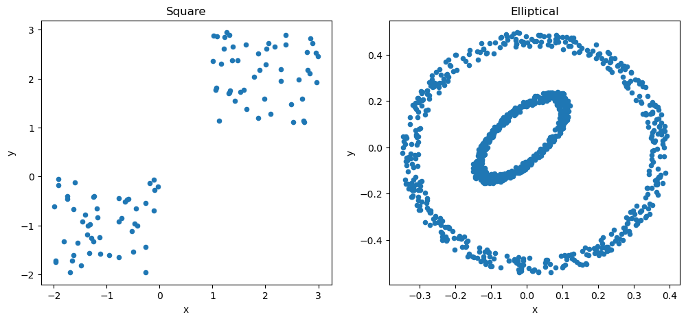

# Clustering
Fresh implementation and analysis of K-means and Spectral Clustering methods with:

- Simulation Datasets: simulated square and elliptical datasets.
- Real-world Datasets: Cho and Iyer gene sequensces datasets.

## Simulation Datasets

## Real-world Datasets
