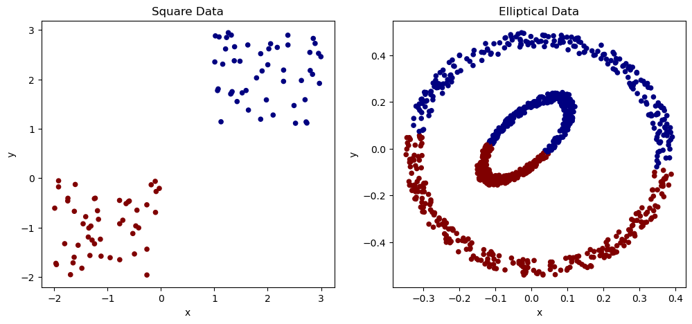
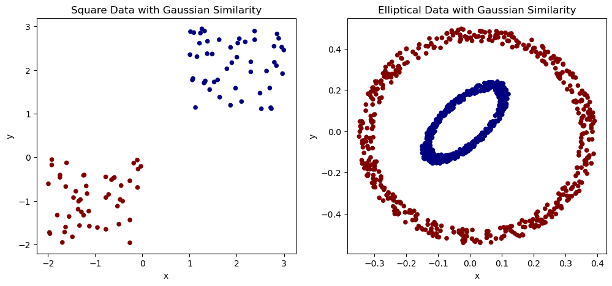
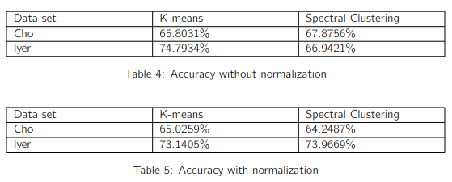

# Clustering

From-scratch implementation and analysis of K-means and Spectral Clustering methods with:

- Simulation Datasets: simulated square and elliptical datasets.
- Real-world Datasets: Cho and Iyer gene sequensces datasets.

The goal of this project is analyze the performance on simple data with 2D features and complex data with 5-11D features.

## Project Structure

- `data/`: datasets.
- `lib/`: implementation of the K-means and Spectral Clustering methods.
- `real_kmeans.ipynb`: analysis of the real-world datasets with K-means.
- `real_spectral.ipynb`: analysis of the real-world datasets with Spectral Clustering.
- `sim_kmeans.ipynb`: analysis of the simulated datasets with K-means.
- `sim_spectral.ipynb`: analysis of the simulated datasets with Spectral Clustering.

## Requirements

- Python
- Jupyter Notebook
- Numpy
- Pandas
- Matplotlib

## Results

### Simulated Datasets

<b>With K-means</b>

<b>With Spectral Clustering</b>

### Real-world Datasets

